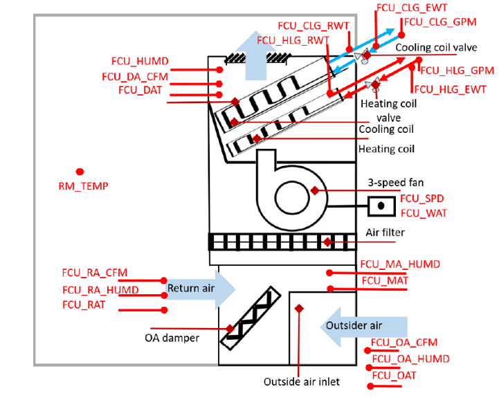

# Multi-criteria KPI analysis in HVAC systems

## Indice
1. [Introduzione](#introduzione)
2. [Descrizione del caso studio](#descrizione-del-caso-studio)
3. [Descrizione del dataset](#descrizione-del-caso-studio)
4. [Calcolo dei KPIs e del loro impatto](#calcolo-dei-kpis-e-del-loro-impatto)
5. [FDD fully data-driven con CS-TAN](#fdd-fully-data-driven-con-cs-tan)
6. [Performance metrics](#performance-metrics)
7. [Conclusioni](#conclusioni)

---

## Introduzione
Questa repository fornisce strumenti per il calcolo di alcuni KPI fondamentali e per la quantificazione dell’impatto di ciascun guasto, considerando simultaneamente più criteri.
Le informazioni ottenute da questa analisi multi-criterio vengono successivamente utilizzate per sviluppare e calibrare la struttura e le probabilità condizionate della rete bayesiana.

---

## Descrizione del caso studio
Il caso studio riguarda una Fan Coil Unit (FCU), caratterizzata da una configurazione idronica verticale a quattro tubi ed è dotata di un ventilatore a tre velocità: alta, media e bassa.
Il ventilconvettore è controllato per mantenere la temperatura dell'aria ambiente entro i setpoint di riscaldamento e raffreddamento impostati dal termostato.
I guasti analizzati sono più di 30 e coinvolgono tutti i componenti del sistema.

Il layout dell'impianto e le variabili monitorate sono riportate nella seguente immagine:

- Maggiori dettagli: [Informazioni specifiche FCU (sviluppato da LBNL)](https://dx.doi.org/10.25984/1881324)

---

## Descrizione dei dati simulati
I dataset, in formato .csv, contenuti all'interno della cartella _data/preprocessed_ hanno già subito una prima fase di pre-processamento.
Ogni dataset contiene dati simulati relativi a una specifica condizione operativa del sistema (compresa la normal operation).
Il periodo di simulazione di ogni dataset è pari a un anno intero, con un timestep di 15 minuti.

---

## Calcolo dei KPIs e del loro impatto
In questa analisi sono stati presi in considerazione 5 KPIs fondamentali:
- Consumo termico giornaliero della batteria di riscaldamento.
- Consumo termico giornaliero della batteria di raffreddamento.
- Consumo elettrico giornaliero del ventilatore.
- Deviazione cumulata giornaliera della temperatura interna dal setpoint (solo durante le ore occupate).
- Frazione media giornaliera di aria esterna rispetto all'aria totale (solo durante le ore occupate).

I KPIs di riferimento sono stati calcolati a livello mensile, facendo una media dei valori giornalieri ottenuti, per ogni dataset a disposizione.

L'impatto dei guasti è stato quantificato utilizzando il Fault Impact Ratio (FIR) come in [Xing Lu et al.](https://www.sciencedirect.com/science/article/abs/pii/S0378778821007325)
Tuttavia, per permette una comparazione equa tra i FIR, è stato calcolato il FIR normalizzato (contenuto tra [0, 100]) per ogni KPI, tramite il metodo di normalizzazione min/max.

L’impatto multi-criterio è stato calcolato generando combinazioni casuali di pesi da una distribuzione di Dirichlet, utilizzate per ottenere il FIR normalizzato medio pesato sui 5 KPIs, per ciascun tipo di guasto.
Il risultato è una classifica che evidenzia i guasti con l’impatto globale più rilevante.

---

## FDD fully data-driven con CS-TAN
Il procedimento per la selezione delle variabili di input, per la costruzione della struttura della rete bayesiana CS-TAN e per la stima delle probabilità condizionate è descritto in questa [repository.](https://github.com/Paolini408/DataDrivenBNClassifierFDD)
La differenza sostanziale, sta nella definizione dei pesi da assegnare a ogni classe.
In particolare, basandosi sul ranking ottenuto dalla fase di analisi multi-criterio, è stato possibile definire i pesi da assegnare a ciascuna classe tramite il metodo _Exponential Weights_.
Conseguentemente, è possibile confrontare i risultati ottenuti con e senza l'analisi multi-criterio.

---

## Performance metrics
Le prestazioni del modello CS-TAN sono state valutate utilizzando le seguenti metriche (ottenibili dalla Confusion Matrix):
- Accuracy
- False Alarm Rate
- False Negative Rate
- Mis-Diagnosis Rate
- Precision (per ogni classe)
- Recall (per ogni classe)

---

## Conclusioni
L’approccio proposto dimostra come l’integrazione tra analisi multi-criterio e modelli data-driven possa migliorare l’efficacia e la sensibilità della diagnosi automatica dei guasti nei sistemi HVAC.

Per ulteriori dettagli, non esitare a contattare il creatore [Marco Paolini](https://github.com/Paolini408).
